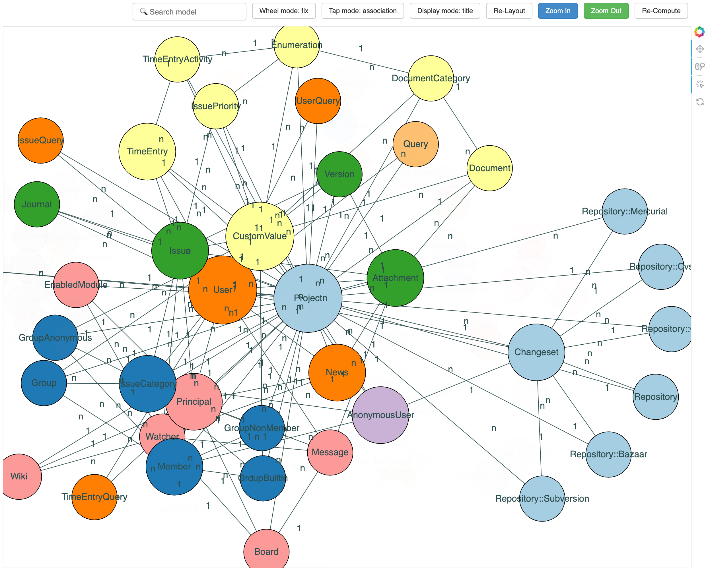
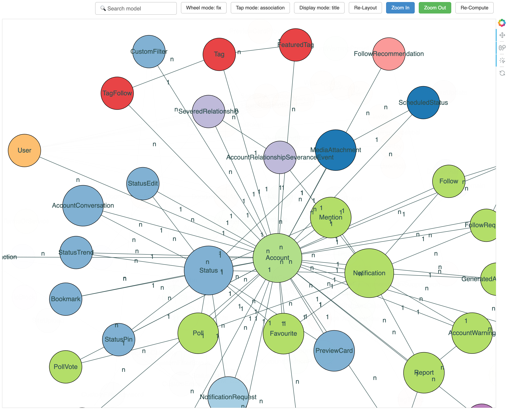

# ErdMap

ErdMap is an ERD map viewer as a Rails engine.

Ruby on Rails applications represent their concepts through models. However, since Rails applications often contain numerous models, understanding them can be difficult. ErdMap helps you comprehend your application by visualizing key models and their associations. It provides a clear starting point for understanding the architecture of your application.
ErdMap initially displays the most "important" models. Then, You can "zoom in" to reveal the next important models interactively, much like navigating a map application.

### Try It Out

Sample visualizations below, based on open-source Rails applications. To try it yourself, open the example HTML files in the `sample` directory.

| [Redmine](https://github.com/redmine/redmine) | [Mastodon](https://github.com/mastodon/mastodon) |
| ------- | -------- |
|  |  |

## Dependencies

ErdMap requires Python3 and the following packages: [`networkx`](https://github.com/networkx/networkx), [`bokeh`](https://github.com/bokeh/bokeh), and [`scipy`](https://github.com/scipy/scipy).  
For Python installation details, refer to the [pyenv installation guide](https://github.com/pyenv/pyenv#installation).

<details><summary>An example for Mac users with Zsh using pyenv for installation</summary>

```bash
# Install pyenv
brew install pyenv
echo 'export PYENV_ROOT="$HOME/.pyenv"' >> ~/.zshrc
echo '[[ -d $PYENV_ROOT/bin ]] && export PATH="$PYENV_ROOT/bin:$PATH"' >> ~/.zshrc
echo 'eval "$(pyenv init - zsh)"' >> ~/.zshrc

# Install latest version of python
pyenv install $(pyenv install --list | grep -E '^\s*[0-9]+\.[0-9]+\.[0-9]+$' | tail -n 1)
pyenv global $(pyenv install --list | grep -E '^\s*[0-9]+\.[0-9]+\.[0-9]+$' | tail -n 1)
```

</details>

```bash
# Install packages, for example with pip
pip install networkx bokeh scipy
# with pip3
pip3 install networkx bokeh scipy
```

## Installation

Add this line to your application's Gemfile:

```ruby
gem "erd_map", group: [:development]
```

And then execute:

```bash
$ bundle
```

## Usage

Add the following to your `config/routes.rb` and access `/erd_map` in your browser:

```ruby
Rails.application.routes.draw do
  mount ErdMap::Engine => "erd_map" if defined?(ErdMap)
end
```

The initial computation might take several seconds. Once completed, the "ErdMap" visualization will be displayed. After the first generation, the map will be cached as an HTML file, so subsequent accesses will display the map instantly without regeneration. If you want to regenerate the map, click the "Re-Compute" button.

The generated HTML file is saved at `/{rails_root}/tmp/erd_map/map.html`.

### Task

You can also explicitly generate the HTML file using rails task.

```bash
bundle exec rails erd_map
```

### Map Controls

- Navigation
  - Wheel Mode: Toggle zooming with the mouse wheel
  - Zoom In: Reveal more models
  - Zoom Out: Display fewer models

- Display Options
  - Tap Mode: Switch between showing associations or communities (see [Algorithm](https://github.com/makicamel/erd_map#Algorithm) section for more about communities)
  - Display Mode: Toggle between showing only model names or including foreign keys

- Layout
  - Re-Layout: Randomly rearrange the displayed models
  - Re-Compute: Regenerate the map to reflect updates to the models

## Algorithm

The initial display shows only the three most "important" models. These models are larger in size, while models displayed upon zooming in are slightly smaller. Importance here is determined by **eigenvector centrality**.

**Eigenvector centrality** is an indicator of how well a model is connected to other highly connected and important models. It considers not just the number of connections a model has, but also the number of important nodes it is connected to.

Additionally, models are organized into groups (communities) and assigned colors for each community. These communities are detected using the **Louvain method**, which discovers strongly connected communities in a network. The method moves and merges nodes iteratively to optimize communities, maximizing modularity (the density of connections), and dividing the network into natural clusters.

Both eigenvector centrality and Louvain method  implementations are provided by [NetworkX](https://github.com/networkx/networkx) library.

## Contributing

Bug reports and pull requests are welcome on GitHub at https://github.com/makicamel/erd_map. This project is intended to be a safe, welcoming space for collaboration, and contributors are expected to adhere to the [code of conduct](https://github.com/makicamel/erd_map/blob/main/CODE_OF_CONDUCT.md).

## License
The gem is available as open source under the terms of the [MIT License](https://opensource.org/licenses/MIT).
